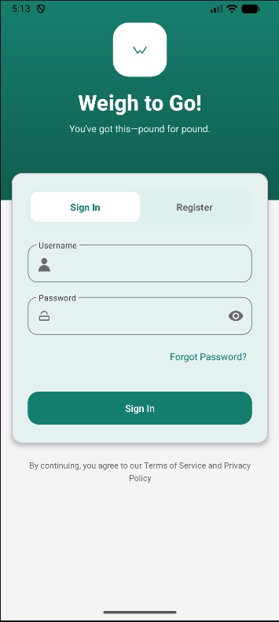
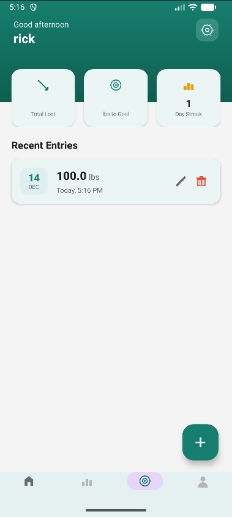
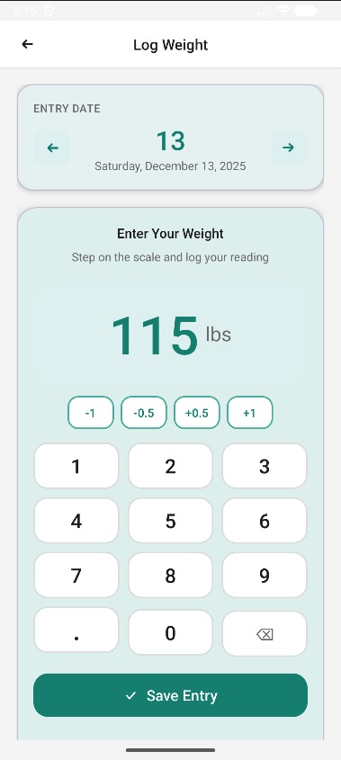
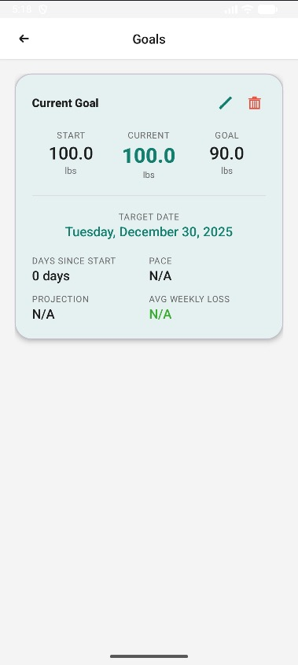
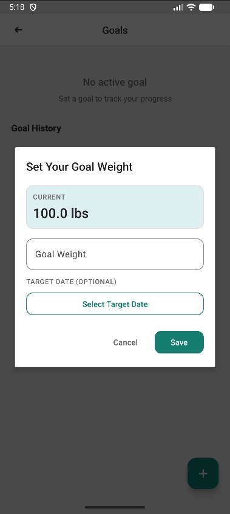
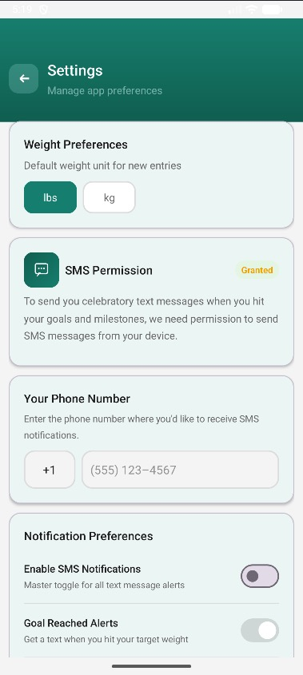

# 🎉 Weigh to Go!

> **"You've got this—pound for pound."**

A weight-tracking application — first built as a native Android app, now being
rebuilt as a full-stack web application. This repository is a **polyglot
monorepo**: it preserves the original Android codebase under `android/` and hosts
the new web codebase under `web/`.


---













---

## 📖 From Mobile to Web

**Weigh to Go!** began as a native Android application (Java, Android Studio),
built for CS 360 at Southern New Hampshire University. A structured engineering
code review of that codebase surfaced architectural debt — over-large activity
classes, model-view-controller drift, database writes on the UI thread,
unmasked personal data in logs, and authentication weaknesses.

Rather than patch those issues in place, the project **rebuilds Weigh to Go! as
a full-stack web application** — a React + TypeScript frontend and a
FastAPI + Python backend over PostgreSQL — with a deliberately layered
architecture, a security baseline applied from the first commit, and
test-driven development throughout. The original Android app is preserved in the
same repository so the evolution from mobile to web reads as one continuous
history.

The decisions behind this approach are recorded in:

- [ADR-0007 — Rebuild as a Full-Stack Web Application](docs/adr/0007-rebuild-as-full-stack-web-application.md)
- [ADR-0008 — Polyglot Monorepo](docs/adr/0008-polyglot-monorepo.md)
- [Software Requirements Specification](docs/specs/WeighToGo_Web_SRS_v1.md) — the
  authoritative specification for the web rebuild

---

## 📁 Repository Layout

```
WeighToGo/
├── android/              # Preserved Android application (Java / Gradle)
│   ├── weightogo/        #   Android app module: source, resources, tests
│   ├── gradle/           #   Gradle wrapper and version catalog
│   ├── build.gradle
│   └── settings.gradle
├── web/                  # Rebuilt full-stack web application
│   ├── frontend/         #   React + TypeScript (Vite)
│   └── backend/          #   FastAPI + Python (PostgreSQL)
├── docs/                 # Shared documentation
│   ├── adr/              #   Architecture Decision Records
│   ├── ddr/              #   Design Decision Records
│   ├── specs/            #   Software Requirements Specification
│   ├── plans/            #   Implementation briefs
│   ├── standards/        #   Engineering standards and checklists
│   ├── architecture/     #   Android database and system architecture
│   ├── design/           #   UI/UX design specifications
│   ├── requirements/     #   Original course requirements (historical)
│   ├── testing/          #   Android testing guides (historical)
│   ├── history/          #   Android development journal
│   ├── api/              #   API documentation (web rebuild, generated later)
│   └── user-guide/       #   End-user documentation (future)
├── previews/             # Android UI preview images
├── scripts/              # Developer utility scripts
├── .github/              # CI workflows, issue and pull-request templates
├── README.md
├── CONTRIBUTING.md
├── SUMMARY.md            # Narrative log of what changed and why
└── LICENSE.md
```

| Path | Contents |
|------|----------|
| `android/` | The original Android application — preserved, still buildable, full test suite passing. Maintenance-only: no new features. |
| `web/` | The web rebuild. Runnable `frontend/` and `backend/` skeletons; feature development follows in subsequent steps. |
| `docs/` | Documentation shared across both stacks: ADRs, DDRs, the SRS, design specs, and architecture notes. |

---

## 🤖 Android Application (preserved)

The Android app is the original artifact. It remains buildable and its full unit
test suite still passes after the monorepo restructure. It is in
**maintenance-only** status — preserved for reference, receiving no new features.

### Features

| Feature | Description |
|---------|-------------|
| 🔐 **User Authentication** | Secure login and registration with encrypted credentials |
| ⚖️ **Daily Weight Logging** | Quick entry with date picker and unit toggle (lbs/kg) |
| 📊 **Weight History** | Chronological display with trend indicators |
| 🎯 **Goal Setting** | Set and track progress toward target weight |
| 📱 **SMS Notifications** | Text-message alerts for goals, milestones, and daily reminders |
| 🔔 **Smart Notifications** | Push-notification alerts when a goal is reached |
| ♿ **Accessibility** | Built-in accessibility settings on every screen |

### Tech Stack

| Technology | Version | Purpose |
|------------|---------|---------|
| **Android Studio** | Ladybug (2024.2.1+) | IDE |
| **Java** | 21 | Primary language |
| **Gradle** | 8.2+ | Build system |
| **Android SDK** | 34 (Android 14) | Target platform |
| **Min SDK** | 26 (Android 8.0) | Minimum supported |
| **SQLite** | Built-in | Local database |
| **Material Components** | 1.11.0+ | UI components |

### Building the Android App

Prerequisites: [Android Studio](https://developer.android.com/studio)
(Ladybug 2024.2.1 or newer), [JDK 21](https://adoptium.net/), and Android
SDK 34 (installed via the Android Studio SDK Manager).

```bash
git clone https://github.com/rgoshen-snhu/WeighToGo.git
cd WeighToGo/android

# Build
./gradlew build

# Run unit tests
./gradlew test

# Run lint
./gradlew lint
```

Open the **`android/`** directory — not the repository root — in Android Studio,
since the Gradle project root moved there during the monorepo restructure.
Android Studio generates `android/local.properties` (the SDK location)
automatically; for command-line builds, set the `ANDROID_HOME` environment
variable or create that file yourself. The debug APK is written to
`android/weightogo/build/outputs/apk/debug/weightogo-debug.apk`.

To run on an emulator, create a device (API 34) in **Tools → Device Manager**
and click **Run**. To run on a physical device, enable USB debugging, connect
the device, and select it from the device dropdown.

### Database Schema

The Android app uses SQLite with five normalized tables. For complete
documentation — SQL scripts, Java implementations, and DAO patterns — see
[`docs/architecture/WeighToGo_Database_Architecture.md`](./docs/architecture/WeighToGo_Database_Architecture.md).

| Table | Purpose |
|-------|---------|
| `users` | Account credentials, contact details, and profile fields |
| `daily_weights` | Each user's dated weight entries |
| `goal_weights` | Target weights, start weights, and achievement status |
| `achievements` | Goal and milestone achievements awarded to a user |
| `user_preferences` | Per-user key/value settings (weight unit, theme, notifications) |

### Design System

| Name | Hex | Usage |
|------|-----|-------|
| Primary Teal | `#00897B` | Primary actions, headers |
| Primary Dark | `#00695C` | Gradients, pressed states |
| Accent Green | `#4CAF50` | Success, positive trends |
| Warning Orange | `#FF9800` | Neutral states |
| Error Red | `#F44336` | Errors, negative trends |

- **Headlines:** Poppins (Bold, SemiBold) · **Body:** Source Sans Pro (Regular)
- 8px spacing grid · minimum 48dp touch targets (Android requirement)

### Permissions

| Permission | Purpose | Required |
|------------|---------|----------|
| `POST_NOTIFICATIONS` | Goal-achievement and reminder alerts | Optional |
| `SEND_SMS` | SMS notifications for goals, milestones, and reminders | Optional |

Both permissions require explicit user consent at runtime (Android 6.0+). The
app is fully usable without granting them; only the notification features are
disabled.

---

## 🌐 Web Application (in progress)

The web rebuild is specified by the
[Software Requirements Specification](docs/specs/WeighToGo_Web_SRS_v1.md), which
is the authoritative source for its architecture, requirements, API, and quality
gates.

| Layer | Technology |
|-------|------------|
| Frontend | React 19, TypeScript 6, Vite 8, Material UI 9 |
| Backend | FastAPI, Python, Pydantic, SQLAlchemy |
| Database | PostgreSQL |

**What's working (Milestone 2):**

- Full user authentication (register, login, logout, token refresh, account lockout)
- Weight entry CRUD: create, list (paginated), get, update, soft-delete
- Dashboard summary: latest entry, total entry count
- Frontend: weight history page, weight entry form (create/edit), dashboard cards
- Cookie-based session auth, rate limiting, RFC 7807 error responses, WCAG 2.1 AA
- 255 backend tests (pytest) · 213 frontend tests (Vitest) · 5 E2E specs (Playwright)

See the [Software Requirements Specification](docs/specs/WeighToGo_Web_SRS_v1.md)
for the full milestone roadmap.

### Running the Backend

Prerequisites: [Python 3.12+](https://www.python.org/),
[uv](https://docs.astral.sh/uv/), and [Docker](https://www.docker.com/).

```bash
cd web/backend
cp .env.example .env             # adjust values as needed
docker compose up -d             # start local PostgreSQL
uv sync                          # install dependencies
uv run alembic upgrade head      # apply database migrations
uv run uvicorn weighttogo.main:app --reload
```

The API is served at `http://localhost:8000`; `GET /health` reports service status.

### Running the Frontend

Prerequisites: [Node.js 20.19+ or 22+](https://nodejs.org/).

```bash
cd web/frontend
cp .env.example .env             # adjust values as needed
npm install
npm run dev
```

The application is served at `http://localhost:5173`.

### Git Hooks

The repository uses [pre-commit](https://pre-commit.com/) to run linting and
formatting before each commit. Activate the hooks once after cloning:

```bash
pre-commit install
```

---

## 🗺️ Roadmap

**Android application** — Version 1.0 delivered: user authentication, daily
weight logging, weight history, goal setting and tracking, achievement
notifications, SMS notifications, and global unit preferences. The Android app
is now preserved in maintenance-only status.

**Web rebuild** — delivered across milestones:

- **Milestone 2** — polyglot monorepo restructure, three-pattern backend
  architecture, and an authentication plus weight-entry vertical slice.
- **Milestone 3** — algorithms and data-structures enhancements, including
  trend analytics and time-series pagination.
- **Milestone 4** — database enhancements.

See the [SRS](docs/specs/WeighToGo_Web_SRS_v1.md) for the full milestone roadmap
and the complete set of functional and non-functional requirements.

---

## 📚 Documentation

| Document | Description |
|----------|-------------|
| [Software Requirements Specification](docs/specs/WeighToGo_Web_SRS_v1.md) | Authoritative spec for the web rebuild: architecture, requirements, API, quality gates |
| [Architecture Decision Records](docs/adr/) | Numbered engineering decisions, Android-era and web-rebuild |
| [Design Decision Records](docs/ddr/) | Numbered design and UI decisions |
| [Android Database Architecture](docs/architecture/WeighToGo_Database_Architecture.md) | SQLite schema, ER diagrams, SQL scripts, and DAO patterns |
| [UI/UX Design Specifications](docs/design/) | Figma design specifications and quick-start guide |
| [`SUMMARY.md`](SUMMARY.md) | Reverse-chronological narrative log of what changed and why |

---

## 🤝 Contributing

Contributions follow the workflow in [CONTRIBUTING.md](CONTRIBUTING.md) — code
style, commit conventions, branching strategy, and the pull-request process.

---

## 📄 License

This project is licensed under the MIT License — see [LICENSE.md](LICENSE.md).

---

## 👨‍💻 Author

**Rick Goshen** — Southern New Hampshire University

- Android original: CS 360, Mobile Architecture & Programming
- Web rebuild: CS 499, Computer Science Capstone

---

## 🙏 Acknowledgments

- [Material Design](https://material.io/) — design guidelines
- [Android Developers](https://developer.android.com/) — documentation
- [Google Fonts](https://fonts.google.com/) — Poppins and Source Sans Pro

---

## 📞 Support

If you encounter an issue or have a question, open an entry on the
[Issues](https://github.com/rgoshen-snhu/WeighToGo/issues) page with detailed
information.

---

<p align="center">
  <strong>Weigh to Go!</strong> — You've got this, pound for pound. 🎉
</p>
