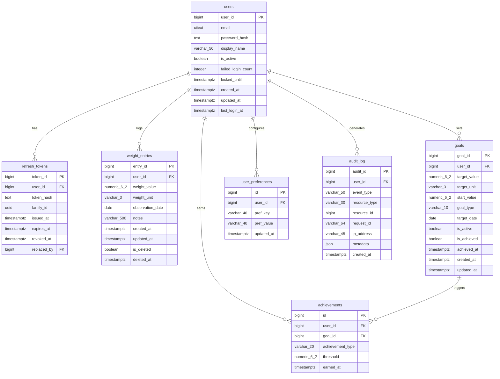

# Weigh to Go! — Web Database Architecture

> Authoritative schema reference for the PostgreSQL web rebuild (CS 499, Milestone 4).
> For the original Android SQLite schema see
> [WeighToGo_Database_Architecture.md](./WeighToGo_Database_Architecture.md).

---

## Table of Contents

1. [Overview](#1-overview)
2. [Entity Relationship Diagram](#2-entity-relationship-diagram)
3. [Schema](#3-schema)
   - 3.1 [users](#31-users)
   - 3.2 [refresh_tokens](#32-refresh_tokens)
   - 3.3 [weight_entries](#33-weight_entries)
   - 3.4 [goals](#34-goals)
   - 3.5 [achievements](#35-achievements)
   - 3.6 [user_preferences](#36-user_preferences)
   - 3.7 [audit_log](#37-audit_log)
4. [Constraints Catalogue](#4-constraints-catalogue)
5. [Index Catalogue](#5-index-catalogue)
6. [Audit Log Design](#6-audit-log-design)
7. [Migration History](#7-migration-history)
8. [Connection and Pooling Policy](#8-connection-and-pooling-policy)
9. [Historical Note](#9-historical-note)

---

## 1. Overview

| Property | Value |
|----------|-------|
| Database | PostgreSQL (psycopg driver) |
| ORM | SQLAlchemy 2 (`mapped_column` / `DeclarativeBase`) |
| Migration tool | Alembic |
| Tables | 7 |
| Migration chain | `0001` – `0010` (fully round-trip verified in CI) |
| SRS reference | §8.2, §8.3, §8.4, §13.3.1 #5 |

| Table | Purpose |
|-------|---------|
| `users` | Account management; CITEXT email; lockout tracking |
| `refresh_tokens` | JWT refresh token store; rotation + family revocation |
| `weight_entries` | Daily weight log; soft-delete; domain-validated |
| `goals` | Active weight goal per user; direction-invariant constraints |
| `achievements` | Milestones, streaks, goal completions; idempotency indexes |
| `user_preferences` | EAV key-value; four preference keys |
| `audit_log` | Security + data-mutation trail; append-only; 14-event taxonomy |

---

## 2. Entity Relationship Diagram

